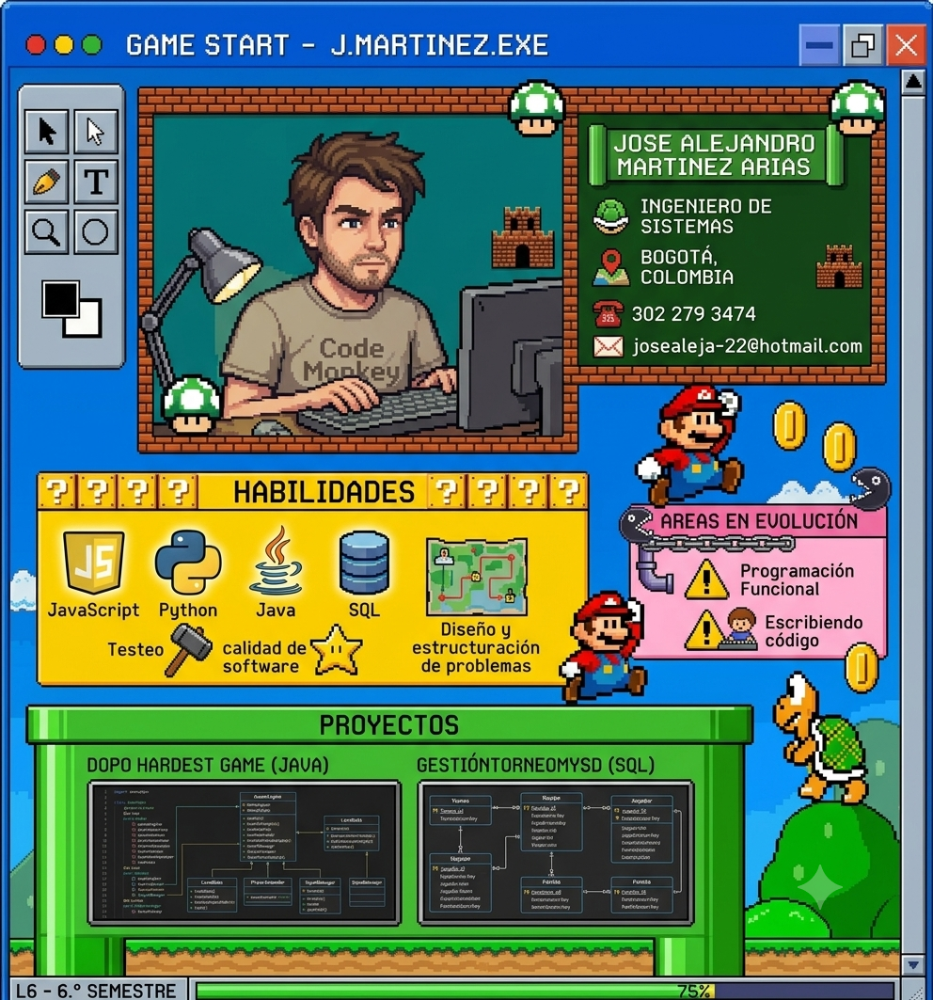
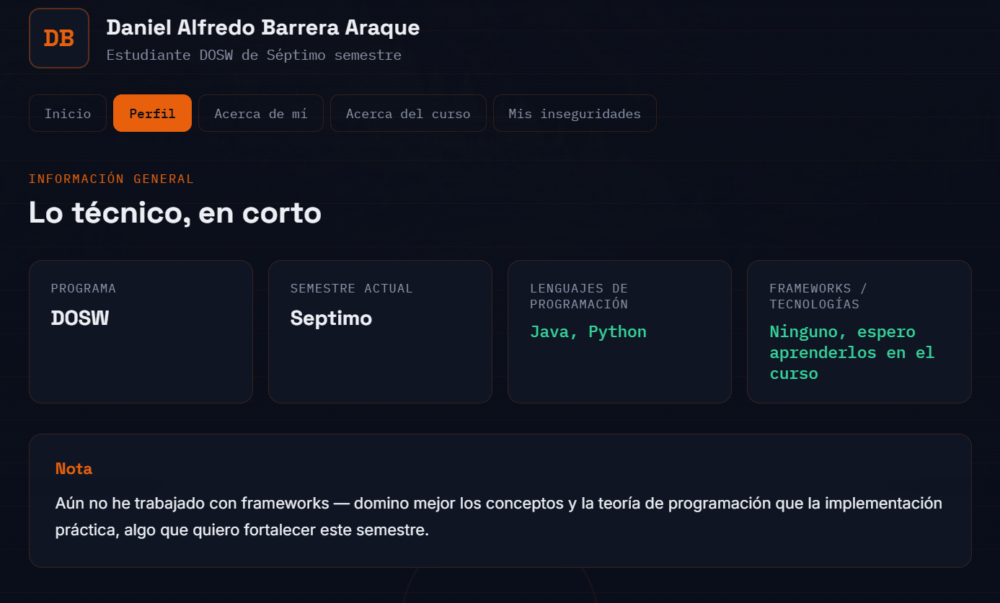
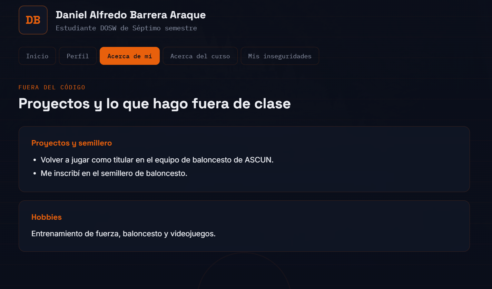
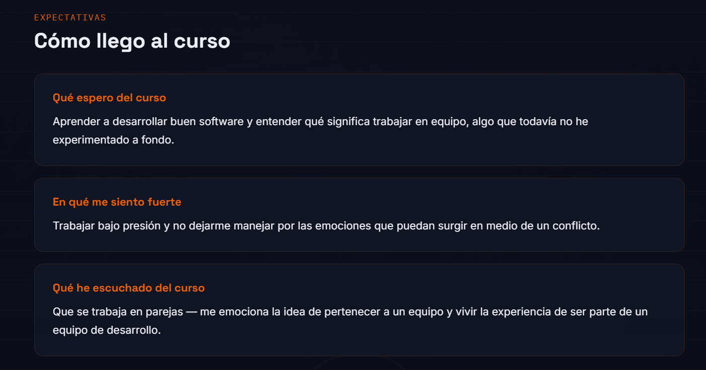
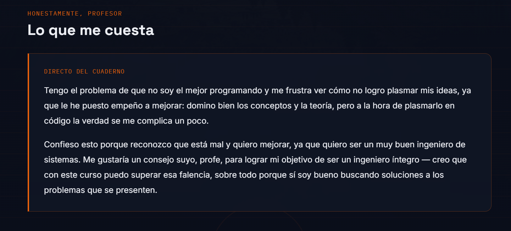

# LAB01DOSW

<h1>Hoja de vida - José Alejandro Martínez Arias</h1>

  

      
  

<h2> ¿Por qué soy el candidato ideal para DOSW Company? </h2>

  

    Soy el candidato ideal para DOSW Company ya que soy una persona que no se rinde fácil, siempre encuentra la forma de solucionar los problemas. Por otro lado, manejo muy bien los conceptos y tengo las habilidades necesarias para ser     parte de este equipo; soy bueno programando y encontrando soluciones que sean eficaces, destacando mi gran habilidad para el diseño de problemas complejos, lo cual es crucial para la extensibilidad de un proyecto.
  

  

    Asimismo, destaco por mis habilidades blandas: soy una persona empática y colaborativa que fomenta un ambiente de trabajo positivo y de confianza, facilitando la integración y el trabajo en equipo.
  

<h1>Hoja de vida - Daniel Alfredo Barrera Araque</h1>

  
  
  
  
  

<h2> ¿Por qué soy el candidato ideal para DOSW Company? </h2
  

    Soy el candidato ideal ya que soy una persona resiliente y que esta disputa a trabajar en un equipo de trabajo, dando lo mejor de mi y solucionando los prblemas que puedan surgir, ademas de que estoy dispuesto a escuchar e implementar los buenos aportes que hagan mis compañeros
  

                                                          

  

    En desarrollo
  

